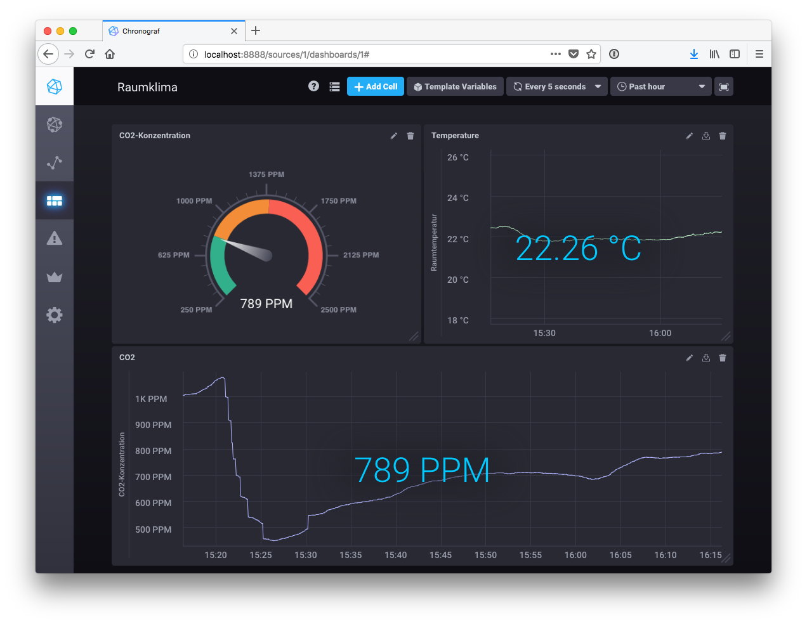

[](https://travis-ci.org/gtudan/co2monitor)

This project reads CO2 concentration and temperatures from a TFA Dostmann CO2 Monitor (these devices are sold under different names, i.e. "Aircontrol CO2 Monitor Mini TFA 31.5006") and writes the 
values to InfluxDB for creating nice dashboards.

There are similiar projects for different devices - I got the idea from the [Freakshow Podcast](https://freakshow.fm). Here's a nice blogpost from InnoQ about a similar setup with a different device: https://www.innoq.com/en/blog/carbon-dioxide-monitoring/


# Installing

This uses libusb and the hidapi to discover the sensor and read data from it.
On Linux you will need to install these libraries in order to compile the program:

* libudev-devel
* hidapi-devel

These are for Fedora/CentOS - they might be called slightly different in other distros.

On MacOS you can do `brew install hidapi`

# Building

You will rust and cargo installed: https://www.rust-lang.org/en-US/

Then just run `cargo build --release` in the project folder and the full binary
will be in `target/release`. All you need from there is the co2monitor binary.

# Running

You can execute the binary without any parameter. It will then print out the readings to your terminal:

```
$ ./target/release/co2monitor
Found device at address USB_04d9_a052_14120000
Temperature(22.850006)
CO2(869)
Temperature(22.912506)
CO2(868)
Temperature(22.912506)
CO2(868)
Temperature(22.850006)
CO2(868)
Temperature(22.850006)
```

Press Ctrl-C to quit.

# InfluxDB

The program sends the measurements to a time-series database called [InfluxDB](https://docs.influxdata.com/influxdb/).

I use UDP since it's the easiest way to do it. Please keep in mind that there is no security whatsoever, so this is only a sane thing to do if you are running influxdb on the same host or a trusted network.

UDP is disabled by default, so you need to enable it. Here is the relevant section from influxdb.conf:

```
[[udp]]
  enabled = true
  bind-address = ":8089"
  database = "climate"
```

Values are writtem to a "climate" database. InfluxDB will automatically create it on start if it
does not exist.

# Chronograf

You can create a nice dashboard visualizing the date using [Chronograf](https://docs.influxdata.com/chronograf/). Mine looks like this:



Here's the json config for it: [Dashboard-Config](doc/dashboard.json)
